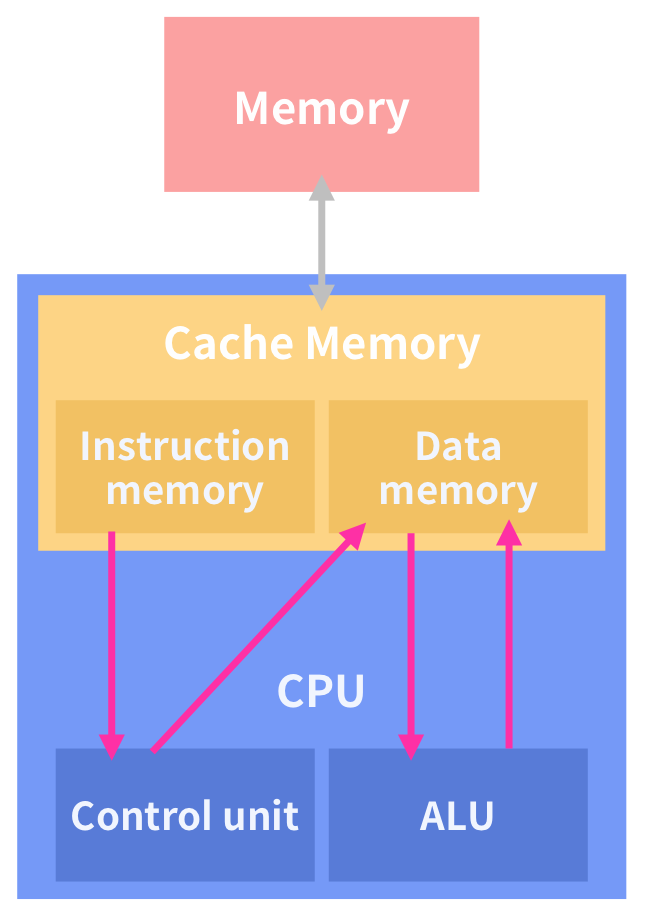

#RAM은 어떤 단어들의 약자이며, 왜 RAM이라 부르게 되었을까?

###RAM
__`RAM`은 `Random Access`로 데이터에 접근하여 읽고 쓰기가 가능한  `주 기억장치`이다.__  

RAM은 CPU가 처리할 데이터를 임시적으로 저장하는 곳이다. 실제 데이터는 하드디스크(HDD:Hard Disk Drive)에 저장되어있고 이 데이터를 RAM으로 가져와 CPU가 처리하는 것이다. CPU와 직접적인 교류가 있는 RAM을 주 기억장치라고 하고 HDD는 보조 기억장치라고 한다.

RAM은 데이터가 어디에 있든 동일한 시간으로 접근하여 읽고 쓰기가 가능하기 때문에 Random Access Memory라는 명칭을 얻게 되었다. RAM은 `주소값`으로 데이터에 접근하기 때문에 동일한 시간이 걸린다.
>보조 기억장치(자기 테이프, 플로피디스크, 하드디스크 등)는 데이터가 저장된 위치에 따라서 접근하는데에 걸리는 시간이 상이하다. 자기 테이프를 예로 들면 이 장치는 데이터에 차례대로 접근하는 순차적 접근방식을 갖고있다.

RAM에 기억된 데이터는 전원이 꺼지면 지워지는 휘발성 기억장치이다. 때문에 전원이 꺼져도 데이터를 보관할 수 있는 보조 기억 장치가 나오게 되었다. 

__RAM의 존재 이유__  
CPU의 속도에 비해 HDD의 속도가 너무 느리기 때문에 병목현상을 줄이기 위해 만들어진 것이 메모리이다. RAM은 HDD로부터 가져온 데이터를 임시로 저장하고 이를 CPU에 빠른 속도로 전달한다.

--

#폰 노이만 구조와 하버드 구조의 한계는 각각 무엇이며 지금은 어떻게 구성된 모습으로 사용되고 있을까?

###Von Neumann architecture
 프로그램 메모리와 데이터 메모리가 물리적 구분없이 단일 메모리를 공유하며, 하나의 주소버스를 통해 CPU와 교류한다. 

###Von Neumann architecture의 한계
명령과 데이터가 같은 주소버스와 메모리를 사용하기 때문에 통신 당 일방향 교류를 하게된다. 단일 버스로 명령을 순차적으로 수행하기 때문에 메모리 처리속도를 증가시키거나 많은 데이터를 처리하려면 지연될 수 밖에 없다. 이를 폰 노이만 병목 현상(Von-Neumann Bottleneck)이라고 한다.

메모리 속박 문제
CPU의 성능이 빨라졌고, 주 메모리의 접근을 줄이는 것이 성능 향상의 key인데 Memory속도가 CPU성능에 비해 느리고 아직 완전히 해결할 수 있는 문제는 아니다.

###Harvard architecture
폰 노이만 아키텍처의 단점을 보완한 것으로 명령어 메모리와 데이터 메모리가 물리적으로 분리되어있다. 메모리마다 주소버스, 데이터버스, 제어버스가 각기 따로 있다. 때문에 명령 접근과 데이터 접근을 동시에 수행할 수 있다. 명령의 처리를 끝내자마자 다음의 명령을 읽어들일 수 있기 때문에 CPU의 처리속도가 향상된다.

###Harvard architectured의 한계
버스 시스템이 복잡하여 설계가 어렵고 처리 속도를 높이기 위해서는 추가적인 회로가 필요하다.(비쌈)  
또한 폰 노이만 구조에 기반으로 만들어졌기 때문에 병목현상만 해결할 뿐 근본적인 구조는 변하지 않는다.

##최근의 구성방식 
최신의 컴퓨터에는 하버드 아키텍처와 폰 노이만 아키텍처를 결합한 방식을 도입하고 있다.  
   
CPU 외부에는 폰 노이만 아키텍처를 적용하고, CPU 내부에는 하버드 아키텍처를 적용한다.   

__CPU 캐시 메모리 형상에 관여__  
캐시 메모리는 명령용과 데이터용으로 분리되어 있다. 하버드 아키텍처는 CPU와 캐시 메모리의 교류에 활용된다. 

__Cache memory__  
캐시 메모리는 속도가 빠른 장치와 느린 장치 사이에서 속도차에 따른 병목 현상을 줄이기 위한 범용 메모리를 말한다. RAM에 저장된 자주 사용하는 데이터를 캐시 메모리에 저장해놓고, 다음에 다시 사용할 때 RAM이 아닌 캐시 메모리에서 데이터를 가져온다. 캐시 메모리를 사용하는 이유는 데이터를 저장하고 인출하는 속도가 주 기억장치보다 빠르기 때문이다.    

>- 캐시 메모리가 CPU와 RAM간의 데이터 처리 속도 차를 완화시켜줌으로써 데이터 처리 속도를 증가시켜주기 때문에 고속완충 기억장치라고한다.  
>- 캐시 메모리는 보통 SRAM이 사용되며 비싸기 때문에 RAM 보다 소용량으로 구성되는 것이 일반적이다
>- 통상적으로 L1캐시에는 명령어 데이터를 사용한다. L1캐시가 L2캐시보다 용량이 적은 편이다. 

#한글을 표현할 수 있는 문자 인코딩 
기존 ASCII코드는 알파벳을 베이스로 만들어졌기 때문에 CJK(중,한,일) 문자는 표현할 수 없고 개수가 많아서 확장 ASCII로도 처리할 수 없다. 

조합형 | 완성형
---- | ----
초성, 중성, 종성에 각각 코드값을 할당 | 고', '양', '이' 와 같은 완성된 문자에 코드값을 할당

조합형은 모든 한글을 표현할 수 있다는 장점을 갖는다. 하지만 코드를 글자로 변환할 때 초성, 중성, 종성에 각각 비트를 할당해야 하기 때문에 부담이 있다. 

완성형은 코드값이 글자를 의미하기 때문에 비트에 대한 부담은 없었지만 한글로 표현될 수 있는 모든 글자를 정의할 수 없다.(제한된 공간 때문)

결국 완성형이 한글 표준안으로 채택되었고, 유니코드의 한글 표현 방식에도 완성형이 먼저 채택되었다고 한다.

__UTF-8__  
조합형의 유니코드인코딩 방식이다. 한글과 한자 등을 3바이트로 표현하고 공백,영문,숫자,기호는 1바이트로 표현한다. 기존 ASCII체계와 호환성을 위한 방식으로 현재 가장 널리 쓰임. 다양한 언어로 작성되는 환경에 적합하다.

단점: 한글만 계산할 경우 DB크기가 1.5배 정도의 공간이 더 필요함.(데이터 규모가 커질 수록 1바이트가 큰 차이를 일으킴)

__EUC-KR__  
EUC-KR은 표준 완성형 인코딩 방식이다. 
한글을 2바이트로 표현.   

단점: 한글을 사용하는 곳에서만 제대로 보인다.

__CP949__  
마이크로소프트가 KS X 1001에 없는 8822글자를 추가하여 EUC-KR을 확장하여 만든 완성형 인코딩 방식이다.
한글을 2바이트로 표현.

단점: 표준 인코딩이 아니라서 인터넷에서 정보를 주고받는 것에 사용되지 않는다.

--
유니코드는 조합형 완성형이 모두 있다.

