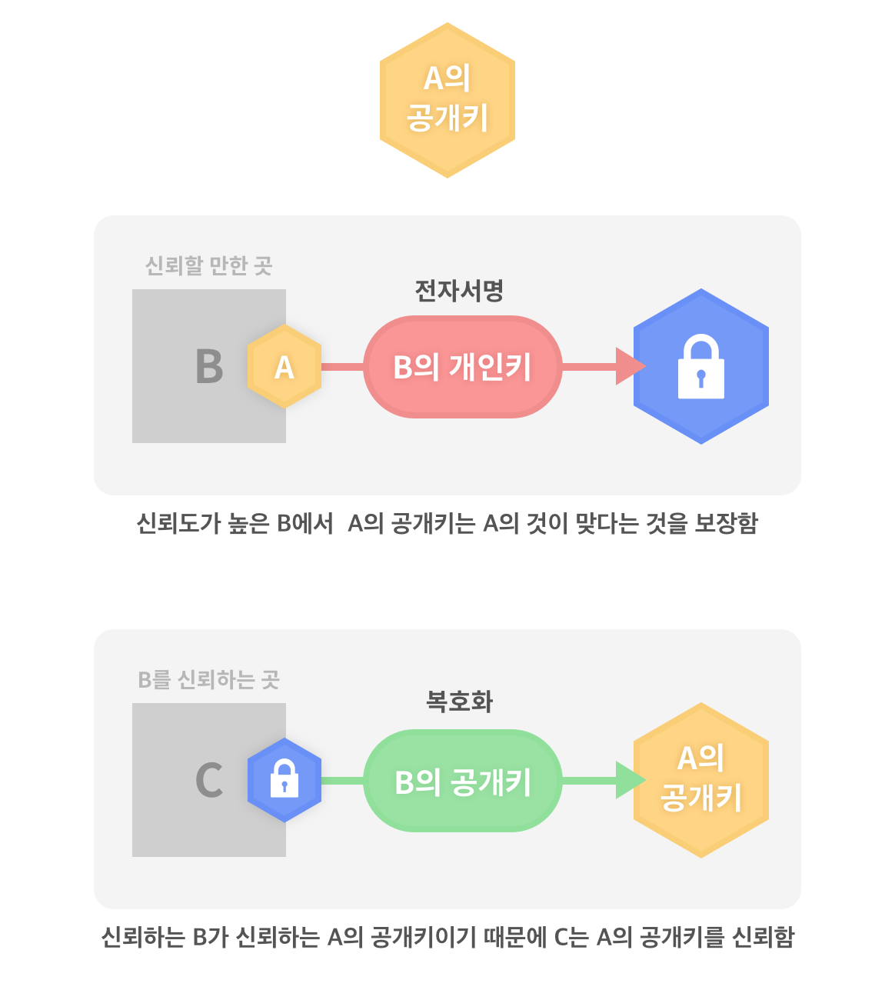

#HTTP와 HTTPS는 무엇이며 그 차이는?

##HTTP
###HyperText Transfer Protocol  

- HTTP는 주로 HTML 같은 문서를 주고받는 데에 쓰인다.  
- TCP와 UDP를 사용한다.

이와 같은 요청/응답(request/response) 통신 규약이 http protocol이다.  
웹 브라우저와 웹 서버가 주고 받는 데이터는 단순 텍스트 메세지이다. 이 메세지 안에 요청받은 HTML페이지도 포함되어 있기 때문에, 네트워크 패킷을 누군가 가로채면 메세지 내용을 그대로 볼 수 있어 보안에 취약하다. 

>__`TCP`__  
>전송 제어 프로토콜(Transmission Control Protocol)  
>인터넷 프로토콜 스위트의 핵심 프로토콜 중 하나로, IP와 함께 TCP/IP라는 명칭으로 불리기도 한다.  
>TCP는 근거리 통신망이나 인트라넷, 인터넷에 연결된 컴퓨터에서 실행되는 프로그램 간에 일련의 옥텟을 안정적으로, 순서대로, 에러없이 교환할 수 있게 한다.
>TCP는 웹 브라우저들이 월드 와이드 웹에서 서버에 연결할 때 사용되며, 이메일 전송이나 파일 전송에도 사용된다.
>
>__`UDP`__  
>사용자 데이터그램 프로토콜(User Datagram Protocol)   
>TCP와 함께 데이터그램으로 으로 알려진 단문 메세지를 교환하기 위해 사용된다.   
>Universal Datagram Protocol 이라고도 함.    
>TCP의 안정성을 필요로 하지 않는 애플리케이션의 경우 일반적으로 TCP 대신 비접속형 사용자 데이터그램 프로토콜(User Datagram Protocol)을 사용한다.   
>이것은 전달 확인 및 순차 보장 기능이 없는 대신 오버헤드가 작고 지연시간이 짧다는 장점이 있다.  
>UDP의 전송 방식은 너무 단순해서 서비스의 신뢰성이 낮고, 데이터그램 도착 순서가 바뀌거나, 중복되거나, 심지어는 통보 없이 누락시키기도 한다. UDP는 일반적으로 오류의 검사와 수정이 필요 없는 애플리케이션에서 수행할 것으로 가정한다.
>
>__`Internet Protocol Suite`__  
>인터넷에서 컴퓨터들이 서로 정보를 주고 받는데에 쓰이는 통신규약(프로토콜)의 모음이다.    
>인터넷 프로토콜스위트 중 TCP와 IP가 가장 많이 쓰이기 때문에 TCP/IP 프로토콜 스위트 라고도 한다.

---

##HTTPS
###Hypertext Transfer Protocol over Secure Socket Layer
메세지 내용의 보안이 필요한 경우에는 HTTPS를 사용한다. 이것은 HTTP와 유사하지만 통신 내용을 암호화한다는 점이 다르다. 

- 주고받는 모든 메세지를 암호화 알고리즘을 통해 암호화 한다.
- HTTPS는 통신의 인증과 암호화를 위해 __`SSL(Secure Socket Layer)`__을 기반으로 개발되었고, 전자 상거래에서 널리 쓰인다.  
- HTTPS를 사용하는 웹페이지의 URL이 __`https://`__로 시작한다.

###SSL
SSL(Secure Socket Layer) protocol은  Netscape사에서 웹 브라우저와 웹 서버 통신의 보안을 위해서 만들으며 이후 TLS(Transport Layer Security)라는 명칭으로 표준화되었다.  

- 웹 브라우저의 기본기능이므로 여타 플러그인을 사용하지 않아도 된다. 
- 암호화 방식은 `대칭키`기법과 `공개키`기법의 장점을 적용한다.    

-

####대칭키

- `대칭키`를 서버와 클라이언트가 같이 사용한다.
- 단일 키 사용 
- 암호화와 복호화에 같은 키를 사용하기 때문에 키를 알게되면 모두 해독이 가능하다.

-

####비대칭키

- 데이터 송신자는 `수신자의 공개키`로 암호화를 하고, 수신자는 `자신의 개인키`로 복호화한다.
- 쌍으로 이루어진 두 키를 사용 (공개키 : 개인키)
- 공개키 기법은 시간이 오래 걸리기 때문에 SSL에서는 `대칭키를 보내는 용도`로만 사용한다. 

-

####SSL의 대칭키와 비대칭키의 조합

- 공개키 기법으로 대칭키를 주고 받은 후 해당 대칭키로 암호화된 데이터를 주고받는다.
- 공개키 기법으로 대칭키를 주고 받기 때문에 대칭키는 안전하게 보호되고, 실제 암복호화는 대칭키로 하기 때문에 비용이 적게 든다는 장점이 있다.
- 대칭키는 임시 대칭키로 매번 랜덤으로 선택되기 때문에 유출되어도 다시 사용할 일이 없어 안전하다. 

---

#국내에 공인인증서가 생긴 배경과 그 위험성은?

##공인인증서의 개념과 작동 원리

###전자서명 원리 

그렇다면 C가 B를 어떻게 신뢰하는가?
다음 그림과 같이 항상 신뢰할 만한 곳이 상위에 재귀적으로 존재한다.
그리고 가장 상위에는 루트 신뢰기관이 나오는데 이는 전세계적으로 하드코딩되어 확실하게 신뢰할 수 있는 공개키를 갖는다.

>__PKI(public key infrastructure)__  
공개 키 기반 구조는 공개키 암호화 방식을 기반으로 전자서명을 사용할 수 있게하는 소프트웨어, 하드웨어, 정책 및 제도 등을 총칭하여 일컫는다.

<!--PKI의 기본 가정: 개인키는 개인만이 소유하고, 공개키는 대중에게 공개된다.-->

###공인인증서
공인 인증서는 전자서명 검증에 필요한 공개키, 소유자의 정보, 공인 인증기관의 전자서명을 인증기관의 개인키로 암호화한 파일이다.

>공인 인증 기관(CA - Certificate Authority)의 주요한 업무는 개인키(Private Key)와 공개키(Public Key)를 공인 인증기관에서 적법한 절차를 거쳐 만들었다는 인증서를 발행하는 것이다. 

   
<!--인증서에는 개인키를 보증하기 위해 쌍이 되는 **공개키**와 공인인증기관이 정식 발행했다는 것을 알리기 위한  **공인 인증 기관의 전자서명**이 들어있다. 
-->

<!--사이트에 인증기관 개인키로 암호화한 인증서(사이트 공개키+사이트정보)를 발행하고 
웹 브라우저에는 인증기관 공개키를발행하여 암호화/복호화 할 수 있도록 한다.-->

##배경
1999년 전자서명법이 제정되었고 공인인증서를 도입하게된다. 공인인증서가 처음 나왔을 때는 SSL기술이 존재했지만 미국에서 수출 제한을 두었기 때문에 이용할 수 없었다. 따라서 국내에서 한국정보보호진흥원(KISA)에서 개발한 암호화 알고리즘인 SEED를 사용하게 되었다. SEED는 국제적인 표준이 아니었기 때문에 웹 브라우저에서 지원을 하지 않았다. 때문에ActiveX 플러그인을 이용한 공인인증서가 금융 거래의 주가 되었고 고착화되었다. 이후 미국의 암호화 수출제한이 풀렸으나 시스템의 개선이 이루어지지 않았다. 

##위험성

###개인키의 보안
국내 공인인증서는 개인키를 사용자가 직접 보관해야한다. 사용자는 개인키를 일반 폴더에 보관하기 때문에 타인이 폴더를 복사하면 공인인증서의 비밀번호를 알아내는 것이 간단하다. 때문에 공인인증서 폴더를 해킹하는 일들이 많아졌다. 보안 의식이 낮은 대부분의 사용자들이 개인키의 안전을 책임져야 하는 구조이기 때문에 위험성이 높다.  
>대부분의 운영체제에는 표준화된 개인키 보관방법을 지원하지만 많은 사람들이 이에 대해 잘 알지 못하고 사용도 또한 낮다.

###ActiveX의 사용
ActiveX는 표준화되지 않은 기술이며, 사용자의 의도하지 않은 프로그램들까지 설치되는 경우가 많다. 이러한 상황에서 악성 프로그램들이 설치될 수 있기 때문에 사고 발생 가능성이 높다. 근래에는 ActiveX를 사용하지 않는 방식이 늘고 있으나 대안역시 ActiveX와 유사한 NPAPI를 사용하기 때문에 위험도는 크게 다르지 않다. 
>악성코드는 개인키를 우선적으로 가져간다. 사용자가 개인키를 저장한 폴더를 빼내서 공인인증서의 비밀번호를 쉽게 알아낸다. 

###저장장치에 따른 독립적 비밀번호 사용
공인인증서는 이를 저장하는 저장장치마다 독립적인 비밀번호를 사용한다. 따라서 저장장치의 분실/유출 상황이 발생했을 때 다른 저장장치에 있는 공인인증서의 비밀번호를 바꿔도 분실된 저장장치의 공인인증서에는 영향을 주지 않는다. 이 경우에는 인증기관에 신고를 한 후 해당 인증서를 폐기 후 재발급 해야한다.

##기술 부채 이슈 
국가에서는 법으로 공인인증서를 사용하는 것을 의무화 하였다. 강제성이 있는 법조항이기 때문에 모두가 공인인증서를 사용해야했다. 보안문제가 많은 공인인증서를 의무적으로 사용하다보니 보안사고가 끊임없이 터졌고 법이 개정되었다.  

2014년 10월 1일 전자금융거래법 개정안이 통과되면서 공인인증서 의무사용 조항이 삭제되었고 2015년 3월 18일 의무사용이 폐지되었다. 따라서 서비스 제공자들은 자율적으로 보안 수단을 선택할 수 있게 되었다.   

하지만 기업들은 이미 공인인증서라는 기술이 사용되고 있는 상황에서 새로운 보안 기술을 개발/적용하려고 하지 않았다. 자체 보안기술을 적용하게되면 보안 책임을 오롯이 서비스제공자가 지게 되기 때문에 기피하였다. 이러한 이유들로 국내의 전자상거래시스템은 기술 부채를 지게 되었다.

>2015년 8월 정부에서는 공인인증서를 발급하는 ActiveX를 없애고 EXE를 사용하기로 했다.

>2015년 7월 마이크로소프트는 Windows10을 출시하며 기본 웹브라우저를 마이크로소프트엣지로 변경하였고 이 브라우저에는 ActiveX와 같은 모든 플러그인 기능을 없앴다. 
>
>2015년 9월 구글에서는 크롬 버전 45에서 NPAPI지원을 중단했다.
>   
>이 결과로 마이크로소프트엣지와 크롬에서는 exe실행이 불가능해졌다.  

결국 위와 같은 이유들로 EXE를 뒤로하고 현재 HTML5 표준화 기술을 기반으로 공인인증서가 개발되고 있다. 

 
