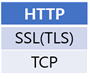
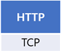
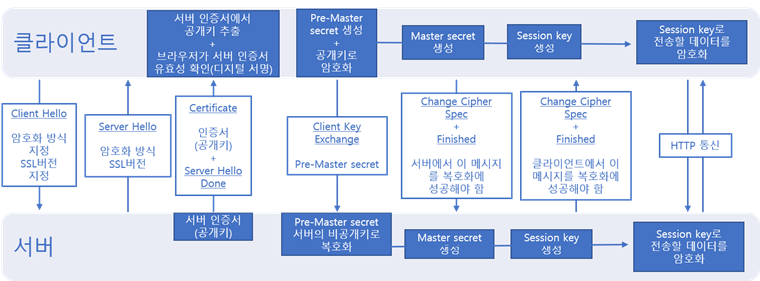

# HTTP와 HTTPS의 차이점

 
## HTTPS (Hyper Text Transfer Protocol over Secure Socket Layer)
HTTP[^1]에 SSL(Secure Socket Layer)가 추가된 것이다. 즉, 보안이 더욱 강화된 HTTP이다.
(보안을 강화해야 하는 이유는 무엇인가? 기존의 HTTP방식에서는 요청과 응답이 전송될 때, 중간에 누군가가 끼어들어 데이터를 가로채고 변조하거나 잘못된 주소를 알려주거나 할 위험성이 있다. 전자상거래뿐만 아니라 단순한 블로깅에도 개인적인 정보가 들어있을 수 있으니 반드시 필요하다.) 기존의 HTTP방식을 그대로 따르되, HTTP요청과 응답 데이터를 네트워크로 보내기전에 암호화한다. (한국에서는 미국정부의 방침 때문에 안타깝게도ActiveX와 공인인증서를 사용한 보안방식을 더 많이 사용하고 있다.)

 
## HTTP와 HTTPS계층구조의 차이
인터넷과 같은 네트워크에서 통신을 할 때 사용하는 프로토콜들은 주로 4가지 계층구조를 이루고 있다. 애플리케이션 계층, 전송 계층, 네트워크 계층, 링크 계층(+물리 계층)이다. (여러가지 프로토콜을 계층으로 나눈 것은 자바로 코딩할 때 캡슐화, 추상화 시키는 것과 비슷한 것 같다. 각 계층에서 다른 사양의 프로토콜을 이용한다고 하면 그 부분만 바꿀 수 있고, 각 계층이 다른 계층이 하는 일을 신경 쓰지 않고 자기의 일만 하면 되기 때문이다.) 아무튼 HTTP는 이 4가지 계층 중에서 애플리케이션 계층에 포함된다. HTTPS의 경우에는 애플리케이션 계층(HTTP)과 전송 계층(TCP) 사이에 SSL(현재 사용하는 기술은 TLS이지만 SSL로 통칭한다고 한다.)을 이용하는 보안계층이 추가된다. 즉, HTTP가 TCP와 직접 통신하지 않고 SSL과 통신한 뒤에 SSL이 TCP와 통신하게 된다.

* HTTPS 계층구조
 

* HTTP 계층구조
 
 
 
 
## HTTPS 작동방식 -SSL 핸드셰이크 (이것이 HTTP와 HTTPS의 차이점의 핵심인 것 같다)
URL의 스킴에 https가 있다면 클라이언트는 본격적인 통신에 앞서 443번 포트로 연결해서 SSL핸드셰이크를 한다. (HTTP방식에서도 TCP는 three way handshaking으로 상대방과 통신할 준비가 되었는지 확인한다. HTTP는 80포트만 사용한다.) 핸드셰이크를 하는 이유는 본격적인 데이터 전달에 앞서 상대방이 존재하는지, 데이터를 주고받기 위한 방법이 무엇인지 파악하기 위함이다. 다음은 SSL 방식의 개요를 간략히 그려본 것이다.

* 작동방식
 

 
 
## 정리하자면 HTTPS방식은
암호화 과정을 거치기 때문에 데이터가 유출되는 것을 방지할 수 있고, 인증서를 통해 상대방을 확인하기 때문에 확실한 상대와 통신할 수 있으며, 중간에 데이터를 가로채서 변조하는 것을 막을 수 있다. 하지만, 암호화 통신 과정에서 리소스가 더 많이 소모되어 성능이 저하되고 CA에서 비싼 인증서를 구입하기 어려운 소규모의 웹사이트는 사용하기 어렵다.
아직까지는 모든 웹에서 HTTPS방식을 사용하고 있지 않지만, 구글과 애플이 HTTPS 대중화를 위해 나섰고 많은곳에서 이용이 증가하고 있다. (렛츠인크립트에서는 무료인증서도 발급해준다고 한다니 사용해봐야겠다.)
 
>참고
>데이빗 고울리 외, HTTP완벽가이드, 이응준, 정상일 옮김, 인사이트, 2014
>우에노 센, 그림으로 배우는 Http&Network Basic, 이병억 옮김, 영진닷컴, 2015
>구글-애플, 'HTTPS' 확산 나섰다, <ZDNet Korea>,2017-01-01
>2016년 HTTPS의 해인가? 적용 웹사이트 ‘급증’ , <보안뉴스>, 2016-12-28
 

[^1]: 웹 상에서 정보를 주고받을 때 따르는 방식(Protocol, 약속)을 말한다. 처음 WWW(World Wide Web)가 제안되었던 1989년에 인터넷에 연결된 컴퓨터들끼리 정보를 공유하기 위한 방식으로써, HTML문서를 URL로 지정된 주소로 HTTP방식으로 전송하기로 약속 하였다. (이후 HTTP/1.0(1996년)이 정식 사양으로 공개되었고, 이듬해 HTTP/1.1(1997년) 이 공개되어 현재까지도 많이 사용되고 있다. 최근에는 HTTP/2.0(2015년)이 공개되었고 모바일환경을 중심으로 사용되고 있다. HTTP의 발전속도는 IT업계의 다른 분야에 비해 조금 느린 것 같다.)
  
    
       
       
***  
  
    
    
  
# 국내에 공인인증서가 생긴 배경과 그 위험성은?

## 공인인증서
전자상거래를 할 때 사용자가 본인임을 인증하기 위해 필요한 전자서명이다. 공인인증서는 사용자 본인만 갖고 있고, 비밀번호도 본인만 알고 있다. 

## 공인인증서가 도입된 배경
1999년 전자서명법 등장과 함께 도입. 이후 전자금융거래(인터넷뱅킹, 증권거래)시 사용이 의무화 되면서 널리 쓰이게 되었다. 현재는 행정 및 전자상거래등 여러 분야에서 폭넓게 쓰이고 있다. 초기에 독자적인 암호화 방식인 SEED와 ActiveX플러그인으로 구현한 시스템을 사용했는데 현재까지 쓰이고 있다. 

## 위험성
* 공개된 사용자의 저장장치에 저장한다는 점
	* 공인인증서 대규모 유출 사례

* 공인인증서가 표준화되지 않은 기술(액티브X)로 배포된다는 점
	* 악성프로그램까지 설치할 수 있다. 
	* 곧 지원이 중단 될 예정 (보안결함이 발견되더라도 고치는 사람이 없다)
	* HTML5로 표준화가 이루어져야 한다. 국제표준과 동떨어진 고립된 인터넷 환경

* 공인인증서 사용의무제(최근 의무제가 폐지되었지만 오랜기간 공인인증서 방식에 의존해왔다) 
	* 국가의 모든 전자금융거래가 하나의 인증기술에만 의존하는 상황으로 보안 취약성이 높아졌다
	* 국내 보안기술의 의미있는 경쟁이 사라짐

