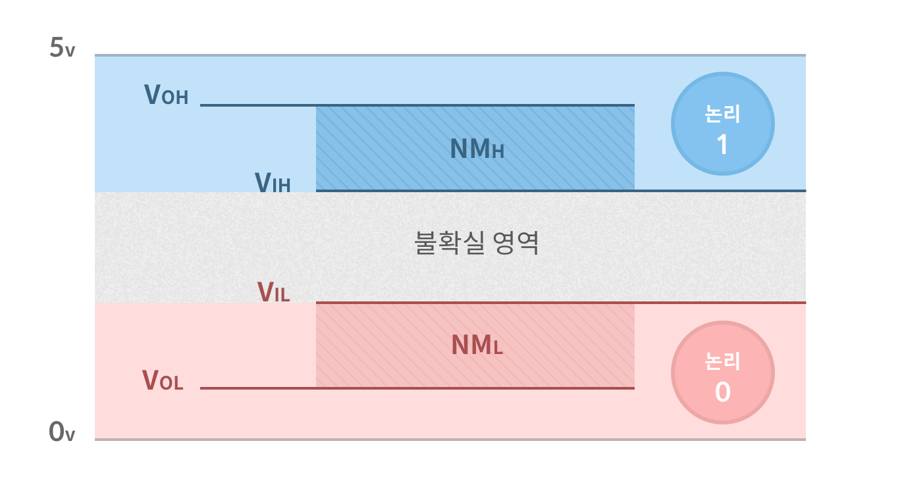

#컴퓨터는 왜 0과 1로 신호를 전달할까?   

컴퓨터는 전기 신호를 받아 0과 1로 구분하는데 이를 이해하기 위해서 먼저 전압과 논리값의 관계를 살펴보았다. 

##전압과 논리값의 관계

####입력 전압

Vih 보다 높은 범위의 입력 전압 | Vil 보다 낮은 범위의 입력 전압
--- | ---
`논리 1`로 인식 | `논리 0`으로 인식

이는 실제의 전압 값에 상관없이 논리적으로 `논리 1` 혹은 `논리 0`과 동일하다고 여긴다.  
>`Vih`보다 낮고` Vil` 보다 높은  범위의 전압 입력값은 예측이 어려운 불확실 영역이다. 그렇기 때문에 전압은 논리값이 확실한 영역에 있어야 해당 논리값을 갖게된다. 입력 전압이 불확실 영역에 속하지 않게 하는 것은 설계자의 영역이다. (증폭기 같은것을 사용할 수 있겠다.)

-

####출력 논리
출력값이 논리 1 이라는 것은 Voh보다 항상 높은 전압을 출력한다는 것을 보장한다. 반대의 경우도 마찬가지.  
Voh와 Vol은 논리 1과 논리 0의 출력 전압 한계를 규정하는 값이다.

출력 논리 1의 실제 출력 전압  | 출력 논리 0의 실제 출력 전압
--- | ---
Voh보다 높은 값 | Vol보다 낮은 값

-

####Noise Margin
노이즈 마진 내에서 일어나는 전압 변동은 논리값에 영향을 주지 않는다.

NMh | NMl
--- | ---
Voh -Vih | Vil - Vol
논리 1 에서 수용할 수 있는 노이즈의 최대 크기 | 논리 0 에서 수용할 수 있는 노이즈의 최대 크기

##왜 0과 1인가?

전압과 논리값의 관계에서 전기신호를 어떻게 0과 1로 인식하고 출력하는지 알아보았다. 컴퓨터 역시 논리 회로를 통해 연산을 하기 때문에 이와 같은 과정을 통해 0과 1을 사용하고 있다는 것을 알 수 있다. __그런데 왜 0과 1뿐일까?__

전압과 논리값의 관계에서 볼 수 있었던 논리 0과 논리 1이 아니라, 사람들에게 더 익숙한 십진수로 나타낸다고 한다면
입력된 전압을 10단계로 나누어 구분해야한다. 이렇게 많은 단위로 나누는 것이 현실적으로 어려운데에는 이유가 있다. 바로 노이즈 때문이다. 기본적으로 노이즈가 없는 회로는 존재하지 않으며, 디지털 회로에서는 논리 0과 논리 1의 상태 전환이 지속적으로 일어나는데 이 시점에도 Switching Noise가 발생하게 된다.
이러한 환경에서는 논리 회로를 더욱 정교하게 설계해야하며, 정밀한 신호 측정을 위한 시간비용을 감수해야한다.

위와 같은 이유로 아직까지는 전기 신호를 두 가지 단계로 나누는 것이 가장 효율적인 방법이기 때문에 컴퓨터는 0과 1을 사용하고 있다.

---

#웹 표준 
웹 표준은 웹에서 지켜야하는 표준 규약이다.  

과거 익스플로러를 전용으로 작성한 코드가 최신 브라우저(사파리, 파이어폭스, 크롬 등)에는 호환되지 않아 웹 개발자들이 각 브라우저를 따로 지원하는 코드를 작성해야했다. 이에 따른 고생은 개발자의 몫이었기 때문에 해외에서는 웹 표준안이 본격적으로 확산되었다.   
표준안을 준수하여 제작한 웹사이트는 특정 브라우저나 OS에 종속되지 않고, 모두 같은 콘텐츠와 화면을 제공할 수 있다. 

###국내의 상황
국내에는 표준안이 뒤늦게 도입이 되었다. 이유는 익스플로러의 점유율이 압도적이었기 때문이다. ActiveX를 아주 다방면으로 잘 활용한 결과, 다른 브라우저 사용자들은 ActiveX를 사용한 웹 사이트를 정상적으로 이용하는 것이 불가능했다.  
이러한 문제점을 인식하고, 웹 표준 확산을 위한 운동들이 펼쳐졌으나(물론 이러한 활동이 유의미했고 정말 필요한 것들이라고 생각하지만..) 결국 시장논리(모바일 기기의 사용률이 높아지면서 표준을 지키는 곳이 많아짐)에 의해 웹 표준이 퍼지게 된다. 

#웹 접근성
가능한 많은 사용자들(정보취약계층을 포함)이 평등하게 웹 콘텐츠에 접근하고 소비할 수 있도록 서비스를 제공하는 것을 뜻한다.  

>웹의 힘은 그 보편성에 있다. 장애에 구애 없이 모든 사람이 접근할 수 있는 것이 필수적인 요소이다. - 팀 버너스 리 (웹 창시자)

###국내의 상황

2008년 시행된 장애인 차별 금지법으로 인하여 공공- 민간 웹사이트의 웹 접근성을 준수하는 것이 의무화되었다. 유예기간을 갖고 단계적 의무화를 했다고 쳐도 거의 10년 전의 이야기이다. 그러나 여전히 국내는 익스플로러의 점유율이 높은 상황이고 ActiveX 문제를 해결하지도 못했다.

접근성을 준수하는 것은 중요한 일이다. 가능한 많은 사람들이 평등하게 콘텐츠를 소비할 수 있어야 하는 것이 더 나은 세상이라고 생각한다. 하지만 이를 위한 국내의 법과 규제는 소기의 목표를 위해 올바른 방식으로 사회에 적용시키고 있는지 의문이 든다. 

